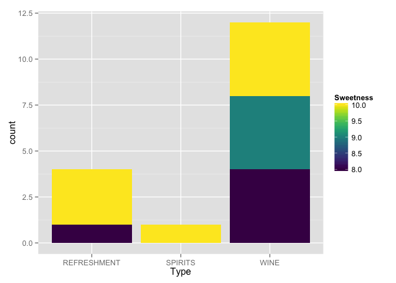
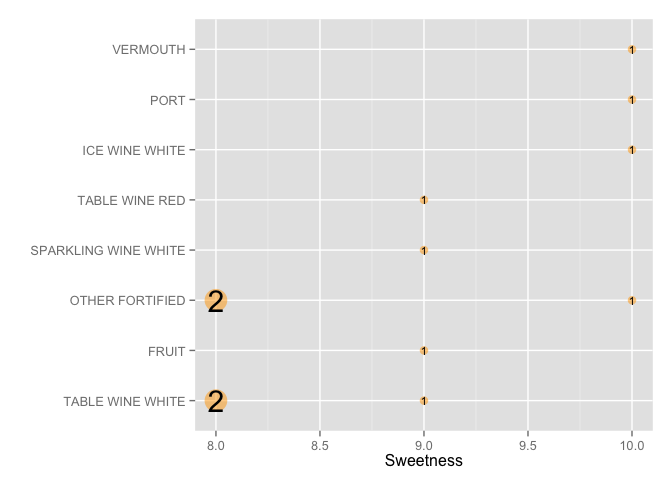
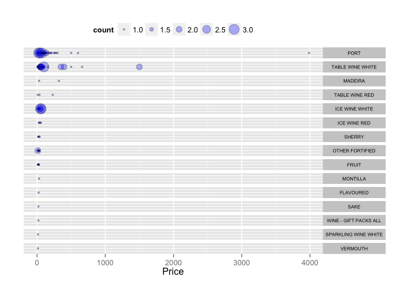
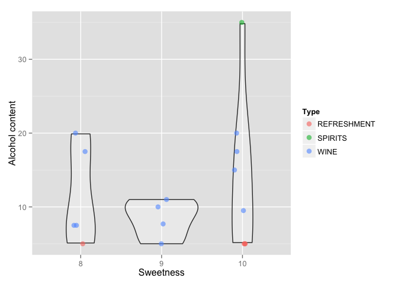

# Building Shiny app
csiu  
December 8, 2015  


```r
library(dplyr)
library(ggplot2)
library(viridis)
```

# Which drink?

**Work so far**

In a class activity, we made a [Shiny app that lets us search for products from the BC Liquor Store based on price, alcohol type, and country]((http://stat545-ubc.github.io/shiny01_activity.html#final-shiny-app-code)). In the followup "[Building Shiny apps](http://stat545-ubc.github.io/hw11_shiny.html)" homework, I will modify the app to explore sweetness.

**My drinking preferences**

I'm not much of an alcohol drinker, so I don't know what's good. I had a couple sips of beer here and there, but nothing worth my fancy and wrote off beer as generally tasting awful. A colleague once told me that "beer does not taste good the first 10 times you try it, but after that, beer will taste good". I am quite skeptical. All I know is that beer is not sweet and leaves a gross aftertaste. This is also true for wine. All I know is that cocktails (and anything that is sweet or tastes like juice) is the way to go. I could be wrong. And here we will explore my drinking options.

**The data**

The data that we will explore comes from the [BC Liquor Store Product Price List](https://www.opendatabc.ca/dataset/bc-liquor-store-product-price-list-current-prices) by OpenDataBC. And the actual version of the data that we will explore is available at: https://github.com/STAT545-UBC/STAT545-UBC.github.io/blob/master/shiny_supp/2015/bcl-data.csv.


```r
bcl <- "https://rawgit.com/STAT545-UBC/STAT545-UBC.github.io/master/shiny_supp/2015/bcl-data.csv" %>% 
  readr::read_csv()
```


### Finding the sweetest budget-friendly drink

I am by no means rich. I am a student and a budget. In this app, I want to be able to answer this question:

> Given a budget, what is the sweetest drink I can buy?

Example: Let say I'm willing to spend $0 (obvious starting point) to $15, then it is recommended I buy ...


```r
(dat.budget <- bcl %>% 
  filter(Price >= 0,
         Price <= 15) %>% 
  arrange(desc(Sweetness))) %>% 
  head() %>% 
  knitr::kable()
```


Type          Subtype          Country    Name                                        Alcohol_Content   Price   Sweetness
------------  ---------------  ---------  -----------------------------------------  ----------------  ------  ----------
REFRESHMENT   SPIRIT           CANADA     SMIRNOFF - ICE RASPBERRY                                5.0    9.99          10
REFRESHMENT   SPIRIT           CANADA     PALM BAY STRAWBERRY PINEAPPLE SPRITZ CAN                5.0    9.99          10
WINE          PORT             PORTUGAL   WARRE'S - WARRIOR RESERVE                              20.0   13.49          10
WINE          ICE WINE WHITE   CANADA     INNISKILLIN NIAGARA - VIDAL ICEWINE 2012                9.5    7.99          10
WINE          VERMOUTH         ITALY      MARTINI - ROSATO                                       15.0   12.99          10
REFRESHMENT   SPIRIT           CANADA     SMIRNOFF - ICE ORANGE SCREWDRIVER                       5.0    9.99          10

Now that we have a list, what on earth is a "REFRESHMENT"? Why is "WINE" on the list? I thought wine is not sweet...

> What else is on this list budget-friendly list of alcohol for Sweetness level >7?


```r
dat.budget %>% 
  filter(Sweetness > 7) %>% 
  group_by(Type, Sweetness) %>% 
  summarise(count = n()) %>% 
  ggplot(aes(x = Type, y = count, fill = Sweetness)) + 
  geom_bar(stat = "identity") +
  scale_fill_viridis()  
```

 

Here we see that for a budget friendly-drink ($0-$15) and a Sweetness level of >7, 

- the major recommendation is WINE, then REFRESHMENTS, and finally SPRITS
- the SPIRITS that are recommended are all Sweetness 10
- no BEER made this list

## Subtypes of sweet WINE
With the bulk of the recommendations being WIND, I wonder what subtypes does this listing refer to:

> Given a budget of $0-$15 and a sweetness level of >7, what are the subtypes of WINE?


```r
dat.budget %>% 
  filter(Sweetness > 7,
         Type == "WINE") %>% 
  group_by(Sweetness, Subtype) %>% 
  summarise(count = n()) %>% 
  ggplot(aes(x = Sweetness, 
             y = reorder(Subtype, Sweetness), 
             label = count,
             size = count)) + 
  geom_point(alpha = 0.5, color = "orange") +
  geom_text(color = "black") +
  scale_size(range = c(3,8)) +
  ylab("") +
  theme(legend.position = "none")
```

 

Here we can see that there is a variety of WINE options -- none of which I'm familiar with. I know what FRUIT is, but what is "VERMOUTH"? Is it expensive?

## Cost of WINE subtypes

> What is the cost distribution of each subtype of sweet WINE (e.g. Sweetness > 7)?


```r
dat.sweetwine <- bcl %>% 
  filter(Type == "WINE",
         Sweetness > 7) %>% 
  #mutate(Price = round(Price, -1)) %>% ## uncomment to round Price to nearest $10?
  group_by(Subtype, Price) %>% 
  summarise(count = n())

dat.sweetwine$Subtype <- with(dat.sweetwine, reorder(Subtype, Price, function(x){-max(x)}))
dat.sweetwine %>%  
  ggplot(aes(x = Price, y = 1, size = count)) +
  geom_point(colour="black", fill="blue", pch=21, alpha = 0.3) +
  ylab("") +
  facet_grid(Subtype~.) +
  theme(
    axis.text.y = element_blank(),
    axis.ticks.y = element_blank(),
    strip.text.y = element_text(size = 6, angle = 360),
    legend.position = "top"
  )
```

 

Here we see that:

- It costs ~$4000 for PORT (Wow, this is some expensive taste)
- TABLE WHITE WINE is also expensive
- VERMOUTH -- in comparision -- is relatively cheap

## What about average alcohol content per sweetness level?
Going back to our budget-friendly ($0-$15) recommendation list, what about alcohol content?

> Given a budget of $0-$15 and a sweetness level of >7, what is the distribution of alcohol content at each sweetness level?


```r
dat.budget %>% 
  filter(Sweetness > 7) %>% 
  ggplot(aes(x = as.factor(Sweetness), 
             y = Alcohol_Content,
             group = Sweetness)) +
  geom_violin(alpha = 0.3) +
  geom_jitter(
    aes(color = Type),
    alpha = 0.6,
    size = 3,
    position = position_jitter(width = .1,
                               height = 0)) +
  scale_size(range = c(3,8)) +
  xlab("Sweetness") +
  ylab("Alcohol content")
```

 

Here we see that: 

- at sweetness 10, there is a broad range of alcohol content 
- SPIRITS are the most alcoholic drink
- REFRESHMENTS are the least alcoholic drink
- there is also a broad range of alcoholic content for WINE

## Conclusion

Overall, from the list of 6132 drinks, I wouldn't be apposed to trying these drinks:


```r
bcl %>% 
  filter(Price <= 15,
         Sweetness == 10,
         Type %in% c("REFRESHMENT", "SPIRITS")) %>% 
  knitr::kable(format = "markdown")
```


|Type        |Subtype             |Country |Name                                     | Alcohol_Content| Price| Sweetness|
|:-----------|:-------------------|:-------|:----------------------------------------|---------------:|-----:|---------:|
|REFRESHMENT |SPIRIT              |CANADA  |SMIRNOFF - ICE RASPBERRY                 |               5|  9.99|        10|
|REFRESHMENT |SPIRIT              |CANADA  |PALM BAY STRAWBERRY PINEAPPLE SPRITZ CAN |               5|  9.99|        10|
|REFRESHMENT |SPIRIT              |CANADA  |SMIRNOFF - ICE ORANGE SCREWDRIVER        |               5|  9.99|        10|
|SPIRITS     |SPIRIT - GIFT PACKS |FRANCE  |PINNACLE - CANDY CANE GIFT PACK          |              35| 13.99|        10|

